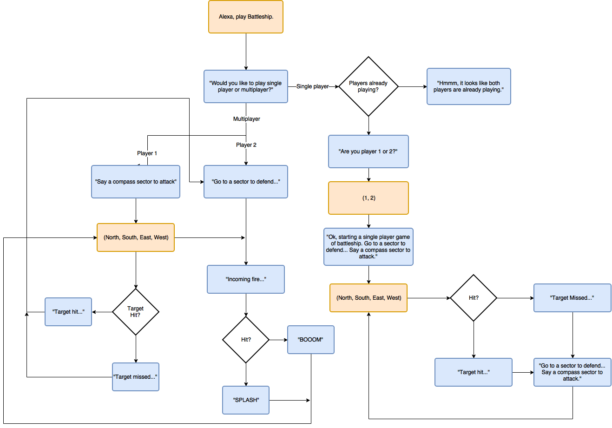

# walabotBattleship
### Voice User Interface Diagram
This diagram gives an outline of how the user interacts with Alexa in this project. Any text the user says is in orange, while Alexa's responses are in blue.

You can use this file to understand the process which takes place in the AWS Lambda function.
#
